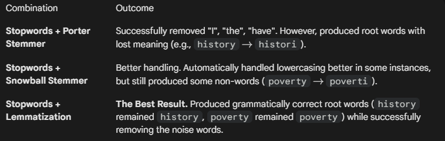

# Stopwords
 Definition: Words that are grammatically necessary but often irrelevant for determining context in tasks like spam classification.
 Examples: "I", "have", "the", "invaded", "us".
 Exceptions: In Sentiment Analysis, words like "not" or "couldn't" are critical. The speaker advises customizing the stopword list to keep these if necessary.

 

