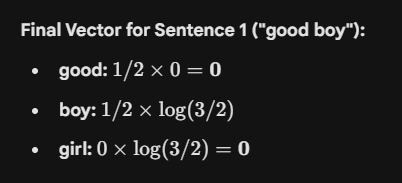

### **Introduction to TF-IDF**

The video introduces TF-IDF as a more efficient technique than Bag of Words for converting text into vectors. While Bag of Words only counts occurrences, TF-IDF assigns weight to words based on their importance across the entire dataset. It is composed of two distinct calculations: **Term Frequency (TF)** and **Inverse Document Frequency (IDF)**. The final vector value for any word is simply the product of these two metrics.

To demonstrate this, the speaker uses a corpus of three sentences with the vocabulary `[good, boy, girl]`:

* **Sentence 1:** "good boy" (2 words)
* **Sentence 2:** "good girl" (2 words)
* **Sentence 3:** "boy girl good" (3 words)

---

### **Step 1: Term Frequency (TF)**

Term Frequency measures how often a word appears locally within a specific sentence. It highlights words that are frequent in a specific document but normalizes the count by the sentence length to prevent longer sentences from having an unfair advantage.

* **Formula:**  {No. of repetition of words in sentence} / {Total no. of words in sentence}

**Example Calculation for Sentence 1 ("good boy"):**

* **Word "good":** Appears 1 time. Total words = 2. **TF = 1/2**.
* **Word "boy":** Appears 1 time. Total words = 2. **TF = 1/2**.
* **Word "girl":** Appears 0 times. **TF = 0**.

---

### **Step 2: Inverse Document Frequency (IDF)**

IDF measures the importance of a word across the entire dataset (corpus). The logic is that words appearing in *every* sentence (like "the" or in this specific dataset, "good") are less informative, so they should be down-weighted. Rare words found in fewer sentences are more distinctive and receive a higher weight.

* **Formula:** log_e ({Total Number of Sentences}/{Number of Sentences containing the word})

**Example Calculation:**

---

### **Step 3: Final TF-IDF Calculation**

The final vector is generated by multiplying the **TF** and **IDF** values for each word.

The most significant observation in this example is the word **"good"**. Even though it appears in every sentence, its IDF score is 0. Consequently, when multiplied by its TF, the final TF-IDF score for "good" becomes **0** for all sentences. This effectively treats "good" as a stopword because it is too common to be useful for distinguishing between these specific sentences.

**Final Vector for Sentence 1 ("good boy"):**

Here is the summary of the transcript regarding the **Advantages and Disadvantages of TF-IDF**, balancing explanatory text with key bullet points.
