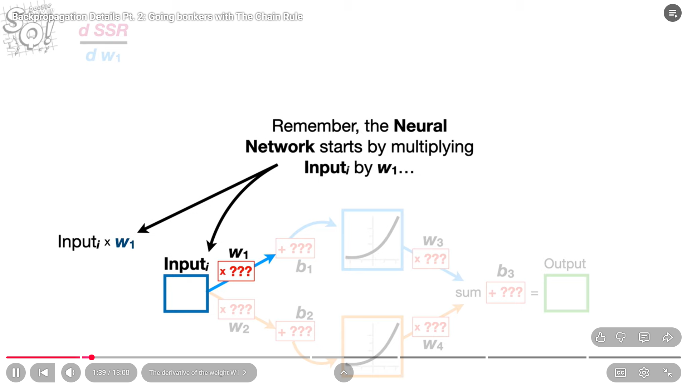

#

# BAckProp Actual Calculation in Neural Networks

# And we initialise the b3 with 0 and start calculation every time we ask gradient what shld be my next better parameter value it answer using new parametrer = oldparameter - gradient*learningrate at the current parameter

 

 # Now we see how do we calculate multiple parameters not just 1 

 

 # At the starting after the farward iteration we would endup something like this with starting trail values
 

 # Notation

 

# Now We Calculate every parameter
 

