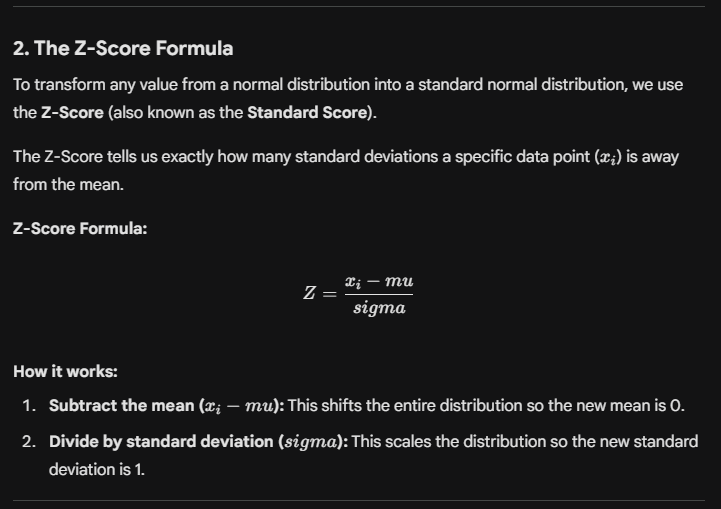
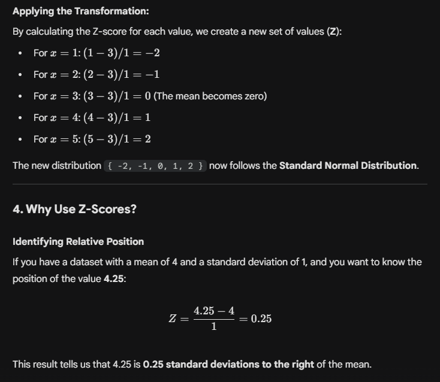

# Standard Normal Distribution and Z-Score

In statistics, while the **Normal (Gaussian) Distribution** is a fundamental concept, the **Standard Normal Distribution** is the specialized form used to compare different datasets, perform hypothesis testing, and prepare data for machine learning.

---

## 1. Defining the Standard Normal Distribution

A **Standard Normal Distribution** is a specific case of the Gaussian distribution where the data has been transformed to meet two strict conditions:

* **Mean (mu) = 0**
* **Standard Deviation (sigma) = 1**

While a regular Gaussian distribution can have any mean or standard deviation, the Standard Normal Distribution always centers at zero and scales by units of one.

### Comparison: Normal vs. Standard Normal Distribution

| Feature | Normal Distribution | Standard Normal Distribution |
| --- | --- | --- |
| **Mean (mu)** | Any real number | **0** |
| **Standard Deviation (sigma)** | Any positive number | **1** |
| **Notation** | X ~ N(mu, sigma) | Z ~ N(0, 1) |
| **Application** | Natural phenomena (Height, IQ) | Data Scaling, Probability Lookup |

---

---

## 3. Practical Example: Step-by-Step Transformation

Suppose we have a random variable **X** with values: `{1, 2, 3, 4, 5}`.

* **Mean (mu):** 3
* **Standard Deviation (sigma):** 1 (Approximate for this example)

---

## 4. Why Use Z-Scores?

### Identifying Relative Position

If you have a dataset with a mean of 4 and a standard deviation of 1, and you want to know the position of the value **4.25**:

This result tells us that 4.25 is **0.25 standard deviations to the right** of the mean.

### Probability and Area Under the Curve

Z-scores allow us to use a **Z-Table** to find the area under the curve. This area represents the probability of a value falling within a certain range. For example, a data analyst can determine what percentage of customers fall above a certain spending threshold by converting their spending to a Z-score.

---

## 5. Standardization in Machine Learning

In real-world data science, we often deal with features that have completely different units (e.g., Age in years, Weight in kg, Salary in dollars).

### The Problem of Scale

If one feature has values in the thousands (Salary) and another in the dozens (Age), many machine learning algorithms will incorrectly prioritize the larger numbers.

### The Solution: Standardization

**Standardization** is the process of applying the Z-score formula to every feature in a dataset. This brings all variables into the same scale, typically ranging between -3 and +3.

**Algorithms that require Standardization:**

* **Clustering (K-Means):** Relies on calculating distances between points.
* **Linear & Logistic Regression:** Helps the model converge (find the optimal solution) faster.
* **Principal Component Analysis (PCA):** Essential for identifying the variance correctly.

By converting diverse features into a **Standard Normal Distribution**, we ensure the machine learning model is efficient, unbiased, and performs at its peak.

---

