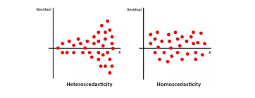

---

# Simple Linear Regression (SLR)

**Simple Linear Regression** is the most fundamental supervised learning algorithm for **Regression** tasks. It establishes a linear relationship between one predictor and one target variable, serving as the conceptual precursor to Deep Learning and Neural Networks.

## 1. The Core Objective

The goal of SLR is to describe the relationship between a single **Independent Variable** and a single **Dependent Variable** using a straight line.

* **Independent Variable (x):** Also known as the **Feature** or Predictor (e.g., Square Footage of a house).
* **Dependent Variable (y):** Also known as the **Label** or Target (e.g., Price of that house).

In SLR, we assume that for every change in **x**, there is a constant proportional change in **y**.

---

## 2. Mathematical Representation

To move from "data points" to a "model," we use the equation of a straight line. In machine learning, we represent it as:

**y = β₀ + β₁x**

Where:

* **y:** The predicted value (Target).
* **x:** The input value (Feature).
* **β₁ (Beta One):** The **Slope**. It represents how much **y** changes for every 1-unit increase in **x**.
* **β₀ (Beta Zero):** The **Intercept**. It represents the value of **y** when **x** is zero.

---

## 3. Geometric Interpretation: The Best Fit Line

When you plot your data on a Cartesian plane, you get a **Scatter Plot**. SLR attempts to draw a single line through these points that captures the general trend.

### How Inference Works

Once the model "learns" the optimal values for **β₀** and **β₁**, the training data is discarded. To predict a new value:

1. Input the new **x**.
2. Calculate the result using the linear equation.
3. The result is your point on the line.

---

## 4. Error Minimization: Ordinary Least Squares (OLS)

The algorithm finds the "Best" line by minimizing the distance between the actual data points and the line itself.

### Residuals (The Error)

A **Residual** is the vertical distance between an actual observed data point (y) and the point predicted by the line (ŷ).

**Residual = y - ŷ**

### The Cost Function

To find the best line, we don't just sum the errors (because positive and negative errors would cancel out). Instead, we use the **Sum of Squared Errors (SSE)**:

**Σ(y - ŷ)²**

The algorithm iteratively adjusts the line's position until this sum is at its absolute minimum. This specific method is called **Ordinary Least Squares (OLS)**.

---

## 5. Comparison: Simple vs. Multiple Regression

| Feature | Simple Linear Regression | Multiple Linear Regression |
| --- | --- | --- |
| **Input Variables** | Exactly **One** (x₁) | **Two or More** (x₁, x₂, x₃...) |
| **Output Variable** | Exactly One (y) | Exactly One (y) |
| **Visual Geometry** | A 2D Line | A 3D Plane or Multi-D Hyperplane |
| **Complexity** | Low (Easy to interpret) | High (Harder to visualize) |

---

## 6. Limitations, Assumptions, and Pitfalls

* **Linearity Assumption:** SLR assumes the relationship is a straight line. If the data follows a curve (like exponential growth), SLR will provide very poor predictions.
* **Sensitivity to Outliers:** Because we square the errors, a single point very far from the line (an outlier) will pull the entire line toward it, ruining the model's accuracy for the rest of the data.
* **Independence:** It assumes that the data points are independent of each other (e.g., today's stock price shouldn't be strictly dependent on yesterday's for a basic SLR).
* **Homoscedasticity:** This fancy term means the "spread" of the errors should be constant. If the errors get much larger as **x** increases, the model's reliability decreases.

    
---

## 7. System Design & "What-If" Analysis

### The "What-If" Scenarios

1. **What if you have 100 features instead of 1?**
* *Question:* Can you still use Simple Linear Regression? How does the "Line" change in a 100-dimensional space?

2. **What if your error (Residuals) starts showing a clear pattern (like a U-shape)?**
* *Question:* Does this mean your SLR model is working, or have you violated the Linearity assumption?

3. **What if you add a new data point that is 100x larger than any other point?**
* *Question:* How will the "Slope" (β₁) react to this outlier?

### FAANG-Level System Design Challenge

**Scenario:** You are building a "Time to Arrival" (ETA) predictor for a food delivery app.

* **Design Task:** Initially, you use SLR where **x = distance** and **y = time**. However, you notice that at 5:00 PM (Rush Hour), the model fails miserably.
* **System Trade-off:** Would you solve this by creating multiple **Instance-Based** local models for different times of day, or would you upgrade to **Multiple Linear Regression** by adding "Time of Day" as a second feature? What are the storage vs. accuracy trade-offs?

---

## 1. Moving to 100 Dimensions

**Scenario:** What if you have 100 features instead of 1?

* **The Transition:** You can no longer use **Simple** Linear Regression; you must use **Multiple Linear Regression**.
* **The Geometry:** In 2D, we have a **Line**. In 3D, we have a **Plane**. In 100D, we have a **Hyperplane**. A hyperplane is a subspace with one fewer dimension than its ambient space (in this case, a 99-dimensional "flat" surface slicing through a 100-dimensional space).
* **The Formula:** The equation expands from $y = \beta_0 + \beta_1x$ to:

$$y = \beta_0 + \beta_1x_1 + \beta_2x_2 + \dots + \beta_{100}x_{100}$$

* **The Catch:** As you add more features, you risk the **Curse of Dimensionality**. If you have 100 features but only 50 data points, your model will perfectly "memorize" the noise (Overfitting), and your predictions will be useless for new data.

---

## 2. The "U-Shaped" Residual Pattern

**Scenario:** What if your error (Residuals) shows a clear pattern?

* **The Diagnosis:** If your residuals (errors) show a U-shape or any non-random pattern, you have **violated the Linearity Assumption**.
* **The Meaning:** A pattern in the error means there is still "information" left in the data that your model failed to capture. A U-shape specifically suggests that the real relationship is **Quadratic** (curved) rather than linear.
* **The Solution:** You should switch to **Polynomial Regression**. This allows the model to "bend" the line to fit the curve. In a perfect model, the residuals should look like "White Noise"—completely random points with no discernible shape.

---

## 3. The 100x Outlier

**Scenario:** Adding a data point 100x larger than the rest.

* **The Reaction:** The Slope ($\beta_1$) will be **heavily distorted**.
* **The "Why":** Remember that Linear Regression uses the **Sum of Squared Errors (SSE)**. If a point is far away, its error is large. When you **square** that large error, it becomes astronomical.
* **The Result:** The algorithm will "panic" and tilt the entire line toward that one outlier just to reduce that one massive squared error, even if it makes the predictions worse for the other 99% of the data. This is why data cleaning and outlier removal are mandatory before running SLR.

---

## 4. FAANG System Design: The ETA Predictor

**Scenario:** Solving the "Rush Hour" failure in a delivery app.

### Option A: Multiple Local Models (Instance-Based logic)

* **Approach:** You create different SLR models for different "bins" of time (e.g., a "Morning Model," a "Rush Hour Model," and a "Night Model").
* **Pros:** Very accurate for specific time windows; easy to debug.
* **Cons:** You have a "fragmented" system. What happens at 4:59 PM vs 5:01 PM? You get a sudden jump in ETA (the "Boundary Problem").

### Option B: Multiple Linear Regression (Generalization)

* **Approach:** You add `Time_of_Day` as a second feature ($x_2$).
* **Pros:** The model learns the continuous transition of traffic. It's a single, compact file (low storage) that handles all scenarios.
* **Cons:** It assumes traffic is a linear factor. If traffic is "non-linear" (e.g., it stays light then suddenly explodes at 5 PM), a basic linear model might still struggle without more complex features.

**Founder's Verdict:** At a FAANG scale, you would choose **Option B** but likely use a **Gradient Boosted Tree** or a **Neural Network**. These models act like Multiple Regression but can handle the "non-linear" sudden spikes of rush hour much better than a straight line.

---

